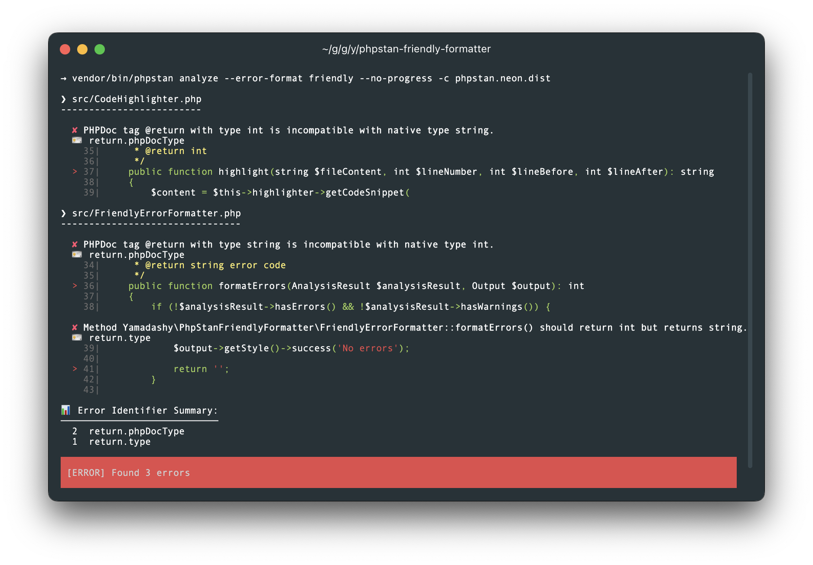
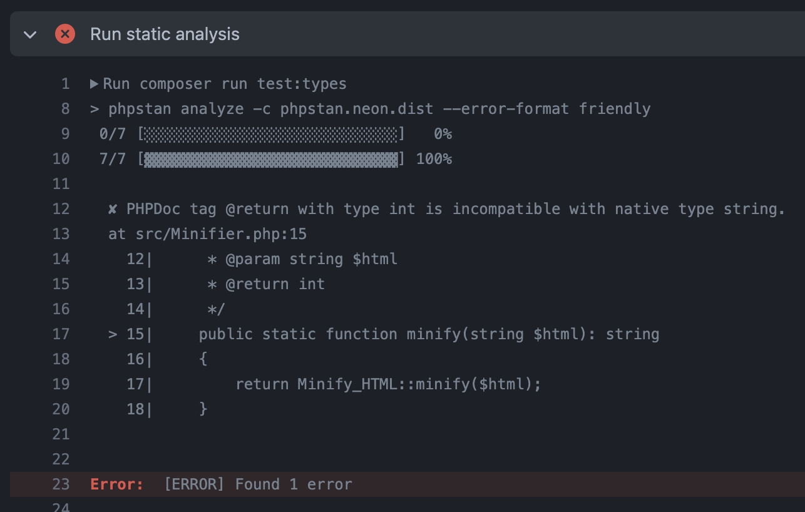

# 🤝 PHPStan Friendly Formatter

[](https://packagist.org/packages/yamadashy/phpstan-friendly-formatter)
[](https://github.com/yamadashy/phpstan-friendly-formatter/actions)
[](https://packagist.org/packages/yamadashy/phpstan-friendly-formatter)
[](https://github.com/yamadashy/phpstan-friendly-formatter/blob/master/LICENSE.md)

Enhance your [PHPStan](https://phpstan.org/) experience with a formatter that brings your code to life! 🚀

## 🌟 Features

- **Display Code Frame**: See the problematic code right where the error occurs
- **Error Identifier Summary**: Get a quick overview of error types and their frequencies
- **Beautiful Output**: Enjoy a visually appealing and easy-to-read error report



## 🎯 Motivation

Ever felt lost in a sea of file paths and line numbers? We've been there! That's why we created this formatter to:

- Instantly pinpoint what's wrong in your code
- Reduce mental overhead when interpreting error messages
- Accelerate your debugging process

## 🚀 Getting Started

1. You may use [Composer](https://getcomposer.org/) to install this package as a development dependency.
```shell
composer require --dev yamadashy/phpstan-friendly-formatter
```

2. Register error formatter into your `phpstan.neon` or `phpstan.neon.dist`:
```neon
includes:
    - ./vendor/yamadashy/phpstan-friendly-formatter/extension.neon
```

3. Finally, set the `errorFormat` parameter:
```neon
parameters:
    errorFormat: friendly
```

### Optional: Simplify Your Workflow
If you want to make it simpler, setting `scripts` in `composer.json` as follows:

```json
{
    "scripts": {
        "analyze": "phpstan analyze --error-format friendly"
    }
}
```

You can run a short command like this:
```shell
composer analyze
```


## ⚙️ Configuration Options
You can customize in your `phpstan.neon`:
```neon
parameters:
    friendly:
        lineBefore: 3  # Number of lines to display before error line (default: 2)
        lineAfter: 3   # Number of lines to display after error line (default: 2)
        editorUrl: 'phpstorm://open?file=%%file%%&line=%%line%%'  # Editor URL (default: null)
```

### Editor URL Configuration

The `editorUrl` option allows you to create clickable links in terminal output that open files directly in your editor.

**Available placeholders:**
- `%%file%%` - Absolute file path
- `%%relFile%%` - Relative file path (useful for Docker/container environments)
- `%%line%%` - Line number

**Editor examples:**
```neon
parameters:
    friendly:
        # PhpStorm / IntelliJ IDEA
        editorUrl: 'phpstorm://open?file=%%file%%&line=%%line%%'

        # VSCode (with absolute path)
        editorUrl: 'vscode://file/%%file%%:%%line%%'

        # VSCode (with relative path - for Docker environments, requires base path)
        editorUrl: 'vscode://file//your/local/project/path/%%relFile%%:%%line%%'

        # Sublime Text
        editorUrl: 'subl://open?url=file://%%file%%&line=%%line%%'
```

> **Note:** When running PHPStan in Docker or other virtualized environments, use `%%relFile%%` instead of `%%file%%` to get the relative path. For VSCode, you may need to prepend your local project path since VSCode requires absolute paths.


## 🖼️ Example
When you actually introduce it in GitHub Actions, it will be displayed as follows.


https://github.com/yamadashy/laravel-blade-minify-directive/actions/runs/4714024802/jobs/8360104870

## 🛠️ Development

```shell
composer test          # Run tests
composer cs-fix        # Fix code style
composer playground    # Test formatter output with sample errors
```

## 📜 License
Distributed under the [MIT license](LICENSE.md).
